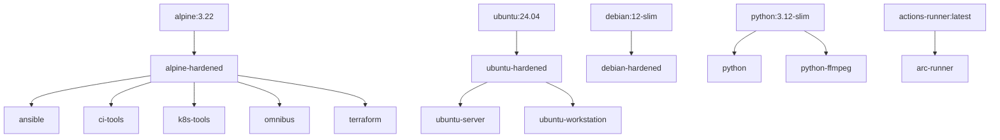
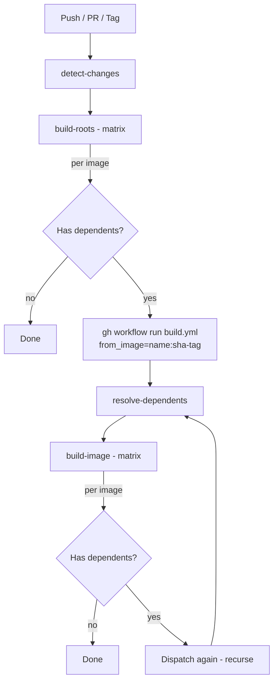
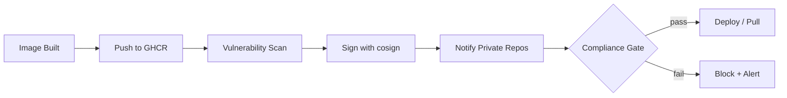

# infra.images

Infrastructure container images with declarative tool management via `tools.yaml`.

## Available Images

| Image | Description | Base | Multi-arch |
|-------|-------------|------|------------|
| **alpine-hardened** | Security-hardened Alpine base | Alpine 3.22 | amd64, arm64 |
| **debian-hardened** | Security-hardened Debian base | Debian 12 | amd64, arm64 |
| **ubuntu-hardened** | Security-hardened Ubuntu base | Ubuntu 24.04 | amd64, arm64 |
| **ansible** | Ansible with git, ssh, jq, yq | alpine-hardened | amd64, arm64 |
| **terraform** | Terraform with git, ssh, jq, yq | alpine-hardened | amd64, arm64 |
| **omnibus** | All-in-one ops image | alpine-hardened | amd64, arm64 |
| **k8s-tools** | kubectl, helm, kustomize, flux, sops, age | alpine-hardened | amd64, arm64 |
| **ci-tools** | shellcheck, hadolint, actionlint, yamllint | alpine-hardened | amd64, arm64 |
| **ubuntu-server** | Server utilities, networking, editors | ubuntu-hardened | amd64, arm64 |
| **ubuntu-workstation** | XFCE desktop with VNC/noVNC access | ubuntu-hardened | amd64 |
| **python** | Python 3.12 with pip | Python 3.12 slim | amd64, arm64 |
| **python-ffmpeg** | Python 3.12 with ffmpeg | Python 3.12 slim | amd64, arm64 |
| **arc-runner** | GitHub ARC runner with Claude CLI | actions-runner | amd64 |

## Quick Start

```bash
# Pull an image
docker pull ghcr.io/labrats-work/infra.images/ansible:1.0.0

# Run a command
docker run --rm ghcr.io/labrats-work/infra.images/ansible:1.0.0 ansible --version

# Run the workstation with VNC
docker run -d -p 6080:6080 -e VNC_PASSWORD=secret \
  ghcr.io/labrats-work/infra.images/ubuntu-workstation:main \
  start-vnc
# Open http://localhost:6080 in your browser
```

## Image Dependency Tree

Images form a dependency tree. When a base image is rebuilt, all its dependents are
automatically rebuilt with the new base, recursively, until every leaf is reached.



**Root** images have external bases (not from this repo). **Leaf** images have no
dependents. The tree can be extended to arbitrary depth.

## Recursive Build System

The CI workflow (`build.yml`) uses a dependency-driven recursive build. The script
`find-dependents.py` scans `tools.yaml` files to resolve the tree at runtime.

### How It Works



Each matrix job follows the same sequence: **generate dockerfile → build → push → test → dispatch dependents → wait**.

### Key Properties

- **Per-image dispatch**: Each matrix job dispatches its own dependents immediately
  after build+push+test, without waiting for sibling images to finish
- **Recursive**: Dispatched workflows follow the same pattern, enabling arbitrary depth
- **Wait-for-completion**: Parent jobs block until their child workflow finishes,
  propagating failures upward
- **Change detection**: On push to `main`, only changed images (and their dependents)
  are rebuilt. On PR/tag, everything is rebuilt
- **Run tracking**: Each workflow run is named `[<run-id>] build-images <- <from_image>`
  so the full chain is visible in the GitHub Actions UI

### Dependency Resolution

```bash
# Find images whose base references alpine-hardened
python3 find-dependents.py --from-image alpine-hardened
# -> ["ansible","ci-tools","k8s-tools","omnibus","terraform"]

# Find root images (external base, not from this repo's registry)
python3 find-dependents.py --roots
# -> ["alpine-hardened","arc-runner","debian-hardened","python","python-ffmpeg","ubuntu-hardened"]
```

The script matches `base:` fields in `tools.yaml` against the registry path
`ghcr.io/labrats-work/infra.images/<name>:`.

### Pros and Cons

**Pros:**

- **Automatic cascade rebuilds** — Changing a base image (e.g. a security patch to `alpine-hardened`) automatically rebuilds every dependent image without manual intervention
- **Arbitrary depth** — The tree is not limited to two levels; you can stack images (e.g. `alpine → alpine-hardened → k8s-base → k8s-prod`) and the recursion handles it
- **Per-image parallelism** — Sibling images build concurrently via matrix strategy, and each dispatches its own dependents immediately without waiting for siblings
- **Pinned base references** — Child workflows receive `sha-<commit>` tags, so derived images always build against the exact base that was just built, not a stale `:main` tag
- **Self-documenting** — Run names `[<run-id>] build-images ← <from_image>` make the full chain visible in the GitHub Actions UI
- **Declarative** — Adding a new image or dependency requires only editing `tools.yaml`; no workflow changes needed

**Cons:**

- **Workflow dispatch overhead** — Each level of the tree spawns a new workflow run via `gh workflow run`, adding ~10-30s of polling latency per level
- **GitHub API rate limits** — Deep trees with many images can generate many API calls for dispatching and polling; large monorepos may hit rate limits
- **Debugging complexity** — Failures in deeply nested dispatches require following a chain of workflow runs in the UI
- **No cross-run artifact sharing** — Each dispatched workflow is independent; there's no shared cache or artifact passing between parent and child runs
- **Single-repo assumption** — The dependency resolver assumes all images live in the same repository and registry path

### Compliance Checks for Private Consumers

If private repositories consume these images, you may want to enforce compliance
policies (vulnerability scanning, license auditing, signature verification) before
those repos can use a new image version.



**Approaches to consider:**

- **Image signing** — Use [cosign](https://github.com/sigstore/cosign) to sign images after build. Private repos verify signatures before pulling
- **Vulnerability scanning** — Run Trivy or Grype as a post-build step. Fail the workflow or flag the image if critical CVEs are found
- **OPA/Rego policies** — Define policies (e.g. "no critical CVEs", "only approved base images") and enforce them in a gate step before tagging as `latest` or a release version
- **SBOM generation** — Generate SBOMs (e.g. with Syft) at build time. Private consumers can audit the bill of materials before adoption
- **Webhook notifications** — After a successful build chain completes, notify dependent private repos (via repository dispatch or webhook) so they can re-run their own CI against the new base
- **Tag promotion** — Build to a staging tag (e.g. `sha-<commit>`), run compliance checks, then promote to `main` / semver tags only if all checks pass. Private repos only pull promoted tags

## Declarative Tool Management

Each image is defined by a `tools.yaml` file that specifies:
- Base image and package manager
- Multi-arch support (amd64, arm64)
- Tools to install via three methods

### tools.yaml Format

```yaml
base: docker.io/alpine:3.22       # or ghcr.io/labrats-work/infra.images/alpine-hardened:main
package_manager: apk               # apk or apt
multi_arch: true                   # build for amd64 and arm64
workdir: /app

build_args:
  - name: VERSION
    default: "1.0.0"

tools:
  # Package install
  - name: git
    description: Version control
    method: package
    package: git

  # Binary download
  - name: yq
    description: YAML processor
    method: binary
    url: https://github.com/mikefarah/yq/releases/latest/download/yq_linux_amd64
    dest: /usr/local/bin/yq

  # Custom script
  - name: terraform
    description: Infrastructure as Code
    method: script
    script: |
      curl -LO https://releases.hashicorp.com/terraform/${VERSION}/terraform_${VERSION}_linux_amd64.zip
      unzip terraform_${VERSION}_linux_amd64.zip -d /usr/local/bin
```

## Adding a New Tool

1. Edit the appropriate `src/<image>/tools.yaml`
2. Add the tool with method: `package`, `binary`, or `script`
3. Commit and push
4. Create a version tag: `git tag 1.1.0 && git push origin 1.1.0`

## Adding a New Image

1. Create directory: `mkdir src/myimage`
2. Create `src/myimage/tools.yaml` with configuration
3. Optionally add `src/myimage/test.sh` for testing
4. Commit and push

To create a **derived** image, set the base to an image from this repo:
```yaml
base: ghcr.io/labrats-work/infra.images/ubuntu-hardened:main
```

The build system will automatically detect the dependency and rebuild your
image whenever its base is updated.

## Versioning

All images share the same version (monorepo style):
- `1.0.0` - Full version
- `1.0` - Major.minor
- `1` - Major only
- `sha-abc1234` - Commit SHA

## Local Development

```bash
# Generate Dockerfile for an image
python3 generate-dockerfile.py --image ansible
cat src/ansible/dockerfile

# Build locally
docker build -t ansible:local src/ansible

# Test
docker run --rm ansible:local ansible --version

# Check dependency tree
python3 find-dependents.py --roots
python3 find-dependents.py --from-image alpine-hardened
```

## Architecture

```
infra.images/
+-- generate-dockerfile.py    # Dockerfile generator from tools.yaml
+-- find-dependents.py        # Dependency resolver for build ordering
+-- src/
|   +-- <image>/
|       +-- tools.yaml        # Declarative tool definitions
|       +-- dockerfile        # Auto-generated (do not edit)
|       +-- test.sh           # Optional test script
+-- .github/workflows/
    +-- build.yml             # Recursive dependency-driven build workflow
```
