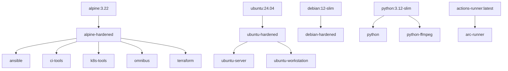
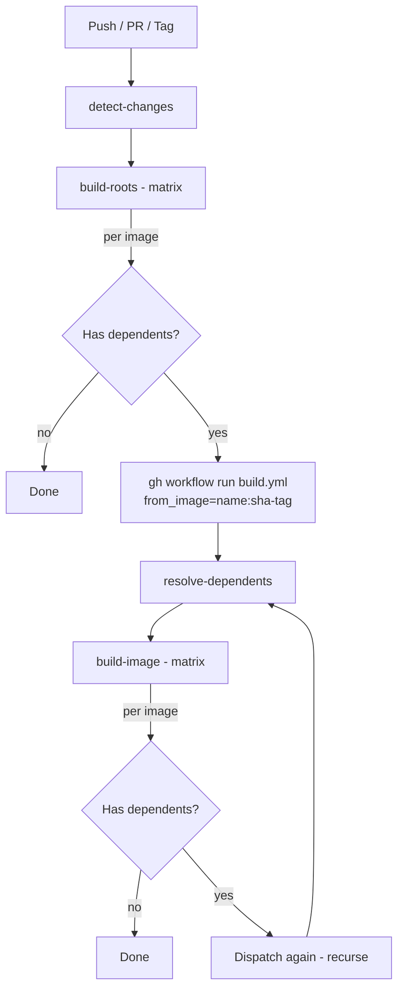
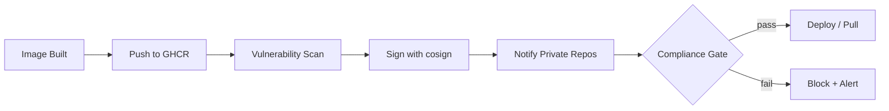

# Recursive Build System

The CI workflow (`build.yml`) uses a dependency-driven recursive build. The script
`find-dependents.py` scans `tools.yaml` files to resolve the image dependency tree
at runtime, then cascades builds from root images down to every leaf.

## Image Dependency Tree

Images form a dependency tree. When a base image is rebuilt, all its dependents are
automatically rebuilt with the new base, recursively, until every leaf is reached.



**Root** images have external bases (Docker Hub, etc.). **Leaf** images have no
dependents. The tree can be extended to arbitrary depth.

## How It Works



Each matrix job follows the same sequence:

**generate dockerfile → build → push → test → dispatch dependents → wait**

### Orchestrator Mode (push / PR / tag)

1. `detect-changes` identifies which root images need building (all on PR/tag, only changed on push to `main`)
2. `build-roots` builds each root image in parallel via matrix strategy
3. After each root is built, pushed, and tested, it checks for dependents
4. If dependents exist, it dispatches a child workflow with `from_image=<name>:<sha-tag>`
5. The parent job blocks until the child workflow completes

### Recursive Mode (dispatched with `from_image`)

1. `resolve-dependents` parses the input to get the image name and tag
2. Runs `find-dependents.py --from-image <name>` to find dependent images
3. `build-image` builds each dependent in parallel via matrix
4. Each build job `sed`s the FROM line to pin the base tag (`main` → `sha-<commit>`)
5. After build+push+test, each job dispatches its own dependents and waits
6. Recursion stops when no image has further dependents

## Key Properties

- **Per-image dispatch**: Each matrix job dispatches its own dependents immediately
  after build+push+test, without waiting for sibling images to finish
- **Recursive**: Dispatched workflows follow the same pattern, enabling arbitrary depth
- **Wait-for-completion**: Parent jobs block until their child workflow finishes,
  propagating failures upward
- **Change detection**: On push to `main`, only changed images (and their dependents)
  are rebuilt. On PR/tag, everything is rebuilt
- **Pinned base references**: Child workflows receive `sha-<commit>` tags, so derived
  images always build against the exact base that was just built
- **Run tracking**: Each workflow run is named `[<run-id>] build-images ← <from_image>`
  so the full chain is visible in the GitHub Actions UI

## Dependency Resolution

The script `find-dependents.py` resolves dependencies by scanning `src/*/tools.yaml`:

```bash
# Find images whose base references alpine-hardened
python3 find-dependents.py --from-image alpine-hardened
# → ["ansible","ci-tools","k8s-tools","omnibus","terraform"]

# Find root images (external base, not from this repo's registry)
python3 find-dependents.py --roots
# → ["alpine-hardened","arc-runner","debian-hardened","python","python-ffmpeg","ubuntu-hardened"]
```

It matches `base:` fields against the full registry path
`ghcr.io/labrats-work/infra.images/<name>:` to avoid false positives
(e.g. `python` matching `docker.io/library/python:3.12`).

## Pros and Cons

### Pros

- **Automatic cascade rebuilds** — A security patch to `alpine-hardened` automatically
  rebuilds every dependent image without manual intervention
- **Arbitrary depth** — The tree is not limited to two levels; you can stack images
  (e.g. `alpine → alpine-hardened → k8s-base → k8s-prod`) and the recursion handles it
- **Per-image parallelism** — Sibling images build concurrently via matrix strategy,
  and each dispatches its own dependents immediately without waiting for siblings
- **Pinned base references** — Child workflows receive `sha-<commit>` tags, so derived
  images always build against the exact base that was just built, not a stale `:main` tag
- **Self-documenting** — Run names `[<run-id>] build-images ← <from_image>` make the
  full chain visible in the GitHub Actions UI
- **Declarative** — Adding a new image or dependency requires only editing `tools.yaml`;
  no workflow changes needed

### Cons

- **Workflow dispatch overhead** — Each level of the tree spawns a new workflow run via
  `gh workflow run`, adding ~10-30s of polling latency per level
- **GitHub API rate limits** — Deep trees with many images can generate many API calls
  for dispatching and polling; large monorepos may hit rate limits
- **Debugging complexity** — Failures in deeply nested dispatches require following a
  chain of workflow runs in the UI
- **No cross-run artifact sharing** — Each dispatched workflow is independent; there's
  no shared cache or artifact passing between parent and child runs
- **Single-repo assumption** — The dependency resolver assumes all images live in the
  same repository and registry path

## Compliance Checks for Private Consumers

If private repositories consume these images, you may want to enforce compliance
policies (vulnerability scanning, license auditing, signature verification) before
those repos can use a new image version.



### Approaches

- **Image signing** — Use [cosign](https://github.com/sigstore/cosign) to sign images
  after build. Private repos verify signatures before pulling
- **Vulnerability scanning** — Run Trivy or Grype as a post-build step. Fail the
  workflow or flag the image if critical CVEs are found
- **OPA/Rego policies** — Define policies (e.g. "no critical CVEs", "only approved base
  images") and enforce them in a gate step before tagging as `latest` or a release version
- **SBOM generation** — Generate SBOMs (e.g. with Syft) at build time. Private consumers
  can audit the bill of materials before adoption
- **Webhook notifications** — After a successful build chain completes, notify dependent
  private repos (via repository dispatch or webhook) so they can re-run their own CI
  against the new base
- **Tag promotion** — Build to a staging tag (e.g. `sha-<commit>`), run compliance
  checks, then promote to `main` / semver tags only if all checks pass. Private repos
  only pull promoted tags
